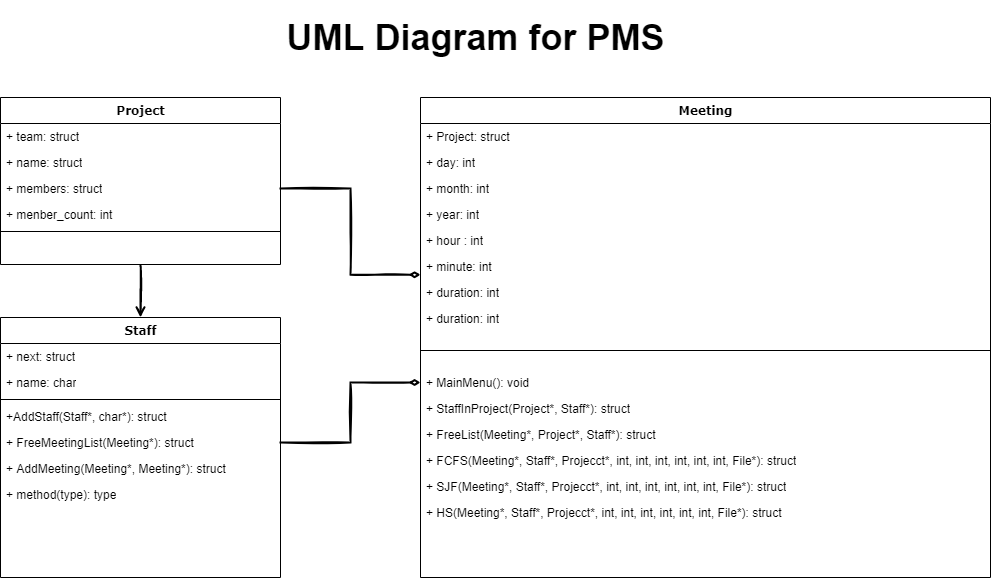

# Project Meeting Scheduler (PMS)

## Introduction
The Project Meeting Scheduler (PMS) is designed to improve meeting scheduling efficiency through the use of an advanced scheduling algorithm. It enables users to establish communication between programs using pipes and manage the creation of meeting schedules effectively. The system allows users to create teams, schedule meetings, and handle potential scheduling conflicts or errors gracefully.

## Key Features
- **Team and Meeting Management:** Users can create custom teams and schedule meetings specifying the time and participants either manually or via file import.
- **Advanced Scheduling Algorithms:** Utilizes various algorithms like FIFO, Shortest Job First, and a humane-oriented scheduling approach to optimize meeting times and resource allocation.
- **Error Handling:** Robust error management for time conflicts, exceeding time limits, and priority overwriting, ensuring reliable schedule generation.
- **I/O Operations:** Command-line input for straightforward interaction and batch processing options for large data handling.
- **Process and Pipe Utilization:** Uses Unix-like pipes and process forking to facilitate efficient inter-process communication and task management.

## Software Architecture

*Figure 1: UML Diagram for PMS*

## Designed Scheduling Algorithm: Humane Schedule
This algorithm ensures non-overlapping meetings and allocates buffer time around lunch hours. It limits the total number of meeting hours per day to prevent over-scheduling, thereby prioritizing staff well-being and operational efficiency.

### Code Snippet:
```cpp
void HS(struct Meeting* meetings, struct Staff* staffs, struct Project* projects, int start_year, int start_month, int start_day, int end_year, int end_month, int end_day, FILE *fp){
    // Code for scheduling meetings ensuring humane conditions...
}
```

## Testing Strategy
The PMS system was rigorously tested under various scenarios including correct inputs, deliberate errors to assess error handling, and edge cases to ensure robustness. The testing phases covered:
- Functional validation of meeting scheduling.
- Error recognition and handling for input commands.
- Load testing with batch inputs.

## Program Setup and Execution
The PMS is compiled and run through a straightforward setup using GCC. Upon execution, users are greeted with a main menu offering various options from team creation to meeting scheduling and viewing.

### Main Menu:
```plaintext
~~~~~~~~WELCOME TO PolyStar~~~~~~~~
1. Create Project Team
2. Project Meeting Request
   2a. Single input
   2b. Batch input
   2c. Meeting Attendance(Syntax: [Team name] [Start date] [End date])
3. Print Meeting Schedule
   3a. FCFS (First Come First Served)
   3b. SJF (Short Job First)
   3c. HS (Humane Schedule)
4. Exit
```

### Example: Program Structures and Functions Setup
```cpp
struct Project { /* Details omitted for brevity */ };
struct Meeting { /* Details omitted for brevity */ };
struct Staff { /* Details omitted for brevity */ };

struct Staff* AddStaff(struct Staff* staffs, char *name);
void FreeMeetingList(struct Meeting* list);
struct Meeting* AddMeeting(struct Meeting* list, struct Meeting* new_meeting);
int StaffInProject(struct Project* project, struct Staff* staff);
void FreeList(struct Meeting* meetings, struct Project* projects, struct Staff* staffs);
void FCFS(struct Meeting* meetings, struct Staff* staffs, struct Project* projects, int start_year, int start_month, int start_day, int end_year, int end_month, int end_day, FILE *fp);
void SJF(struct Meeting* meetings, struct Staff* staffs, struct Project* projects, int start_year, int start_month, int start_day, int end_year, int end_month, int end_day, FILE *fp);
void HS(struct Meeting* meetings, struct Staff* staffs, struct Project* projects, int start_year, int start_month, int start_day, int end_year, int end_month, int end_day, FILE *fp);
void ChildProcess_FCFS(int read_fd, struct Meeting* meetings, struct Project* projects, struct Staff* staffs);
void ChildProcess_SJF(int read_fd, struct Meeting* meetings, struct Project* projects, struct Staff* staffs);
void ChildProcess_HS(int read_fd, struct Meeting* meetings, struct Project* projects, struct Staff* staffs);
```

### Create Project Team
Teams are created with unique identifiers and personnel configurations. Input validation ensures that team names and member counts are appropriate.

```plaintext
Enter an option: 1
Enter> Team_A Project_A Alan Billy Cathy Eva
>>>>>> Project Team_A is created.
Enter> Team_B Project_B Cathy David Eva Fanny
>>>>>> Project Team_B is created.
Enter> Team_C Project_C David Eva Helen
>>>>>> Project Team_C is created.
Enter> Team_D Project_D Cathy Billy Alan
>>>>>> Failed.
Enter> Team_E Project_E Helen Billy
>>>>>> Project Team_E is created.
Enter> 0
```

### Meeting Booking and Schedule Printing
Project meetings are scheduled with options for single or batch inputs. The system handles scheduling according to predefined algorithms (FCFS, SJF, HS) and provides feedback on scheduling success or issues related to conflicts or timing restrictions.

#### FCFS Example
```plaintext
Enter an option: 3
Enter> FCFS 2022-04-25 2022-04-27
*** Project Meeting ***
Algorithm used: FCFS
Period: 2022-04-25 to 2022-04-27
...
```

#### Exit Process
Termination of the program is managed through the main menu, ensuring all processes are cleanly stopped.

```plaintext
~~~~~~~~WELCOME TO PolyStar~~~~~~~~
1. Create Project Team
...
4. Exit
Enter an option: 4
Good bye!
```

This setup provides a comprehensive guide for users to effectively interact with the Project Meeting Scheduler, ensuring smooth operation from team setup to meeting scheduling and review.
